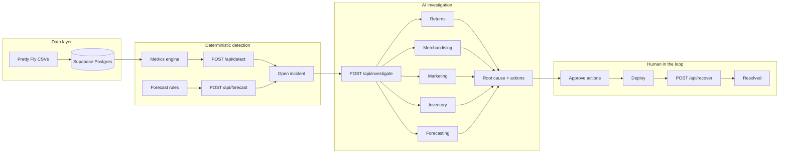

# Resolve (return-zero)

**Commerce incident response — detect, investigate, fix, and recover in one place.**

Ecommerce incident response for the **Pretty Fly** demo brand: detect KPI breaches, investigate with AI, approve fixes, and track recovery. Built for the **Wayflyer × Fin Hackathon** (3–5 June 2026).

> **Engineering has Incident.io. Ecommerce has Resolve.**

| | |
|---|---|
| **Live demo** | [return-zero-57ht-nodir-s-projects1.vercel.app](https://return-zero-57ht-nodir-s-projects1.vercel.app) — sign in with Supabase Auth, then open **Catalog** or **Incidents** |
| **Repo** | [github.com/nodirumurkulov/return-zero](https://github.com/nodirumurkulov/return-zero) |
| **Project board** | [Linear — Run-zero](https://linear.app/run-zero/team/RUN/all) |

**Stack:** Next.js 16 · TypeScript · Supabase (Auth + Postgres) · Vercel · Bun (`frontend/`)

---

## The problem

When conversion drops, returns spike, or inventory stockouts, the damage is already in the P&L. Operators still:

- Spot the issue late in a spreadsheet or weekly review
- Pull data from returns, merchandising, marketing, and inventory in separate tools
- Debate root cause in Slack without a shared timeline
- Ship fixes without tracking whether the metric actually recovered

Resolve closes that loop: **math finds the breach, agents explain it, humans approve the fix, and the platform monitors recovery until the incident resolves.**

---

## What we built

| Surface | What you see |
|--------|----------------|
| **Catalog** | Health across ~62 SKUs — return rate, ROAS, stock, support volume — with per-product thresholds |
| **Incidents** | Kanban board from `detected` → `resolved`, with severity, £ impact, and status |
| **Incident detail** | Parallel AI agent findings, synthesized root cause, ranked actions, approval flow, and timeline |
| **Slack** (optional) | Notifications when incidents need attention; approve low-risk actions from the channel |

The hero demo is **Court Trainer Return Spike**: a sizing-driven return crisis tied to cold Meta traffic and downstream UK11/UK12 stockouts — seeded with realistic agent findings and proposed fixes.

---

## How it works



### Design principle: math first, LLM second

KPIs, thresholds, and forecasts are **configuration in the database** (`metric_definitions`, `product_kpi_thresholds`, `forecast_rules`) — not hardcoded magic numbers.

| Layer | Role |
|-------|------|
| **SQL source functions** | Neutral facts: revenue, refunds, ads, support, monthly series, daily outflow |
| **Metrics engine** | Computes status (`healthy` / `warning` / `critical`) from config-driven operations |
| **Detection** | Opens incidents on breach or forward-looking forecast risk — **no LLM** |
| **Five agents + synthesizer** | Query Supabase, then **narrate** structured context with an LLM (OpenAI or Anthropic) |

### Incident lifecycle

`detected` → `investigating` → `fix_proposed` → `awaiting_approval` → `deploying` → `monitoring` → `resolved`

Recovery uses a **projected** KPI path after deploy (demo-friendly on static fixture data). `POST /api/recover` advances the monitoring clock and auto-resolves at 100% recovery.

### Investigation agents

| Agent | Focus |
|-------|--------|
| 📦 Returns | Refund reasons, sizing vs fit, £ exposure |
| 🛍️ Merchandising | PDP content, size guides, category benchmarks |
| 📣 Marketing | Campaign attribution, first-order vs repeat buyers |
| 🏭 Inventory | Stock levels, size-level stockouts, reorder pressure |
| 🔮 Forecasting | Deterministic stockout / refund / revenue projections (LLM summarizes only) |

---

**Judge demo:** [hackathon/judge-demo.md](hackathon/judge-demo.md) (5-minute walkthrough).

---

## Overview

| Piece | Location |
|-------|----------|
| Web app and API | [`frontend/`](frontend/) |
| Database migrations | [`frontend/supabase/`](frontend/supabase/) |
| Seed and validation scripts | [`frontend/scripts/`](frontend/scripts/) |
| Deployment and analytics docs | [`docs/`](docs/) |
| Hackathon materials | [`hackathon/`](hackathon/) (data pack, demo script, PDF) |

Humans read **`README.md`** in each folder; coding agents read the matching **`AGENTS.md`**.

---

## Prerequisites

- [Bun](https://bun.sh) 1.3+ (frontend install, lint, build)
- Supabase project with migrations applied
- Supabase Auth enabled (email/password for local demo)
- LLM API key (OpenAI or Anthropic)

## Environment variables

Copy [`.env.example`](.env.example) to `frontend/.env.local` and fill in values.

| Variable | Purpose |
|----------|---------|
| `NEXT_PUBLIC_SUPABASE_URL` | Supabase project URL |
| `NEXT_PUBLIC_SUPABASE_ANON_KEY` | Public anon key (browser + RLS server client) |
| `SUPABASE_SERVICE_ROLE_KEY` | Server routes and scripts only |
| `OPENAI_API_KEY` / `ANTHROPIC_API_KEY` | Investigation agents |
| `LLM_PROVIDER` | `openai` or `anthropic` |
| `SLACK_WEBHOOK_URL` | Outbound incident notifications (optional) |
| `NEXT_PUBLIC_APP_URL` | Base URL for links in Slack |
| `CRON_SECRET` | Protects `/api/detect`, `/api/forecast`, `/api/recover` when set |

Details: [`docs/DEPLOYMENT.md`](docs/DEPLOYMENT.md).

## Local development

```bash
cp .env.example frontend/.env.local   # edit with real keys
cd frontend && bun install && bun run dev
```

Open **http://localhost:3000** → sign in → **Catalog** / **Incidents**.

### Seed demo data

Apply SQL in [`supabase/migrations/`](./supabase/migrations/) in filename order, then:

```bash
cd frontend && bun install
bun run seed
```

Validators need a seeded project: `bun run validate` (see [`frontend/scripts/README.md`](frontend/scripts/README.md)).

### Before you open a PR

```bash
cd frontend && bun run check && bun run build
cd frontend/supabase && supabase start && cd .. && bun run db:reset && bun run db:lint
```

---

## API routes (automation & demo)

| Method | Path | Purpose |
|--------|------|---------|
| `POST` | `/api/detect` | Scan catalogue for KPI breaches; open new incidents |
| `POST` | `/api/forecast` | Predictive incidents from forecast rules |
| `POST` | `/api/investigate` | Run five agents + synthesize root cause & actions |
| `POST` | `/api/incidents/[id]/approve` | Approve actions; start deploy / monitoring |
| `POST` | `/api/recover` | Advance monitoring recovery; auto-resolve |
| `POST` | `/api/slack/webhook` | Slack interactive approvals (when configured) |

---

## Deployment

Deploy on Vercel with **Root Directory** set to `frontend`. See [`docs/DEPLOYMENT.md`](docs/DEPLOYMENT.md).

## Troubleshooting

| Symptom | Likely cause | What to do |
|---------|--------------|------------|
| Empty catalog or incidents | DB not seeded | Run `scripts` seed against your Supabase project |
| Auth redirect loops | Supabase redirect URL mismatch | Add `http://localhost:3000/**` and your Vercel URL in Supabase Auth → URL configuration |
| Investigation fails | Missing LLM key or provider | Set `OPENAI_API_KEY` or `ANTHROPIC_API_KEY` and `LLM_PROVIDER` |
| Cron routes 401 | `CRON_SECRET` set | Send `Authorization: Bearer $CRON_SECRET` or clear for local dev |

---

## Team

Built by the **[Run-zero](https://linear.app/run-zero)** team (Wayflyer × Fin Hackathon):

| Name | Focus |
|------|--------|
| **Avinash menon** | Frontend & design — incidents kanban, incident detail, design system, app shell |
| **Naseem** | Frontend — product catalog, KPI editor, app shell, Slack cards, Vercel deploy |
| **Botir Khaltaev** | ML & AI — KPI detection, severity scoring, five-agent investigation, recovery monitoring |
| **Mohamed El Amine Atoui** | Data — Pretty Fly pipeline, SQL metrics layer, analytics for catalog & agents |
| **nodir** | Security & platform — Supabase Auth, RLS, API hardening, env & deploy config |

---

## Why this matters for Wayflyer

Pretty Fly (and real merchants) live on **unit economics**: returns erode margin, ads amplify bad fit, stockouts kill reorder LTV. Resolve treats those KPIs like production incidents — with severity, ownership, evidence, and closure — so finance and ops can **act before the quarter closes**, not after.

---

## Related docs

| Audience | Start here |
|----------|------------|
| Humans | [`README.md`](README.md) → nested `README.md` |
| Agents | [`AGENTS.md`](AGENTS.md) → nested `AGENTS.md` |

- [`docs/DEPLOYMENT.md`](docs/DEPLOYMENT.md) — Vercel, env, cron
- [`docs/analytics-and-forecasting.md`](docs/analytics-and-forecasting.md) — metrics and forecast behavior
- [`hackathon/README.md`](hackathon/README.md) — Pretty Fly data pack and demo materials
- [`frontend/README.md`](frontend/README.md) — frontend onboarding

---

## License

MIT — see [LICENSE](./LICENSE).

**Last reviewed:** 2026-06-04
